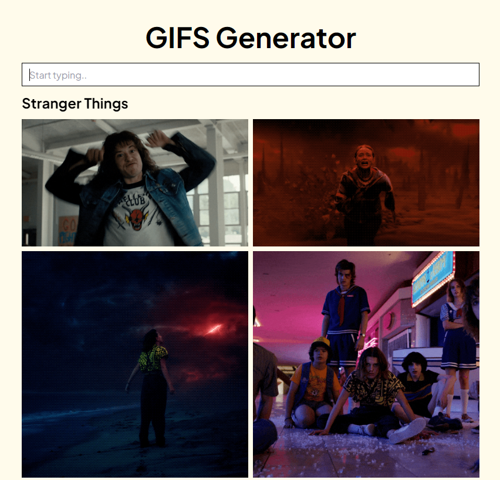

# GIF Generator

In this project you can generate gifs using Giphy API. This app is created mainly with React and Tailwind CSS.

## Table of Contents

* [General Info](#general-information)
* [Technologies Used](#technologies-used)
* [Features](#features)
* [Screenshots](#screenshots)
* [Contact](#contact)

## General Information

- GIF Generator using Giphy API

## Technologies Used

- HTML5 - Tailwind CSS - React - Javascript 

## Features

- Fully responsive
- Max GIFs generated: 20

## Screenshots

## Contact

Created by [Adrian Kervin](https://www.linkedin.com/in/kervinmarquinez/) - feel free to contact!